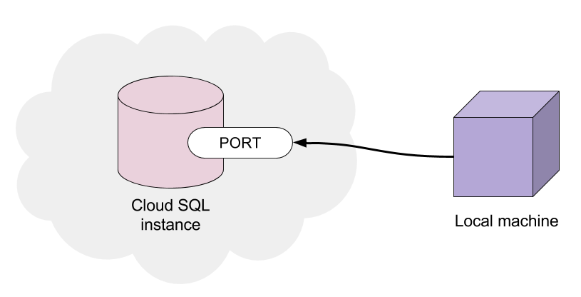
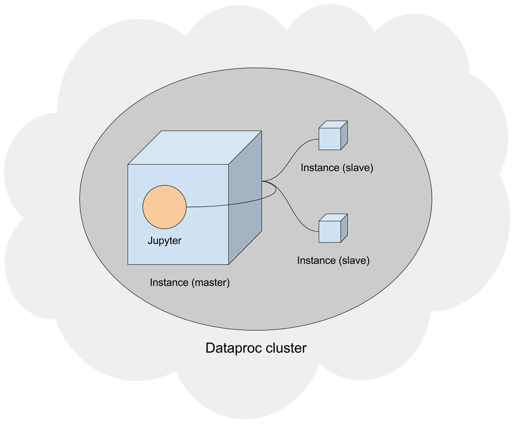
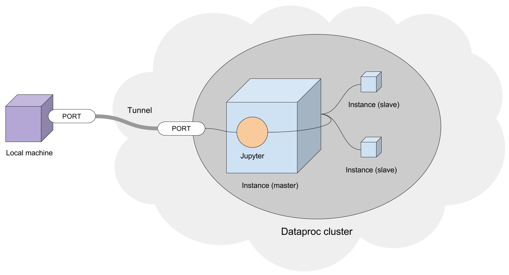

# gcp-jupyter-sql
It can be *very* useful to outsource processing to the cloud as it allows for easy horizontal and vertical scaling. Google Cloud Platform has all the necessary infrastructure to run Jupyter Notebooks in the cloud, from creating a clusterized server configuration of notebooks, to reading and writing data to a database based on Cloud SQL.

The following are instructions to run a (Python 3, Anaconda3) Jupyter Notebook Server using Google Cloud Platform's Dataproc (for clusterized processing) or Compute Engine (for normal processing), as well as Cloud SQL for storing data. A script is provided for uploading CSV data to Cloud SQL, as well as an example of how to query Cloud SQL into a Pandas DataFrame.


The steps are as follows:
- [Setup project](#setup-project)
- [Setup Cloud SQL](#setup-cloud-sql)
  - [(Optional) Upload CSV](#optional-upload-csv)
  - [(Optional) Create separate users](#optional-create-separate-users)
- [Setup Jupyter Notebook Server](#setup-jupyter-notebook-server)
  - [(Optional) Install Anaconda3](#optional-install-anaconda3)
- [Setup SSH tunnel to instance](#setup-ssh-tunnel-to-instance)
- [Connect to the Jupyter Notebook Server](#connect-to-the-jupyter-notebook-server)
  - [(Optional) Query Cloud SQL to Pandas DataFrame](#optional-query-cloud-sql-to-pandas-dataframe)

## Setup project
Download and install [Google Cloud SDK](https://cloud.google.com/sdk/). Once installed, the `gcloud` command should be usable from any command prompt with an up-to-date PATH variable.
Run some command prompt, or the included Google Cloud SDK Shell and create a project (if not created one yet):
```
gcloud projects create [PROJECT_ID] --name [PROJECT_NAME]
```
Set this project as the current, working project:
```
gcloud config set project [PROJECT_ID]
```
> NOTE: This will remove the need to specify the project on every `gcloud` call.

## Setup Cloud SQL
Run some command prompt, or the included Google Cloud SDK Shell and create a Cloud SQL PostgresQL instance:
```
gcloud sql instances create [INSTANCE_NAME] --database-version POSTGRES_9_6
```
Check and take note of the newly created instance's external IP:
```
gcloud sql instances list
```

Go to the [Cloud SQL instance's page](https://console.cloud.google.com/sql/instances), select your instance, and go to **Databases** > **Create database** and create one.

In order to be able to connect to the instance locally, it is necessary to whitelist the local IP. [Search for your IP on Google](https://www.google.com/search?q=ip). This is the easiest way to get your local, external IP. Then, go to **Authorization** > **Add network** and enter this IP.

### (Optional) Create separate users
By default, the `postgres` user will have all required privileges, but you might want to create separate users. To add a user, use the following command (where `HOST` refers to the instance's IP):
```
gcloud sql users create [USER_NAME] [HOST] --instance [INSTANCE_NAME] --password [PASSWORD]
```
The newly created user will have limited privileges. To grant additional privileges, you need to go to **Overview** > **Connect to this instance** > **Connect using Cloud Shell**. The Cloud Shell will open with a default connection command available. Press enter to get access to the PSQL client.

Once inside, switch to the database you want:

```
\c [DATABASE_NAME]
```

Grant the privileges you want to the desired user. For example, all privileges on all tables:

```sql
GRANT ALL PRIVILEGES ON ALL TABLES IN SCHEMA public TO [USER_NAME];
```

### (Optional) Upload CSV
The easiest way to upload a CSV is to use Python. Connect to the Cloud SQL instance using SQLAlchemy, load the CSV using Pandas, and insert it to some table.

<p align="center">
  
</p>

Import both Pandas and SQLAlchemy:
```python
import pandas as pd
from sqlalchemy import create_engine
```

Connect to the Cloud SQL instance using SQLAlchemy:
```python
settings = {
   'user': '[USER_NAME]',
   'pass': '[PASSWORD]',
   'host': '[HOST]',
     'db': '[DATABASE_NAME]'
}
url = 'postgresql+psycopg2://{user}:{pass}@{host}:5432/{db}'.format(**settings)  # 5432 is the default port
engine = create_engine(url, client_encoding='utf8')
```

Load the CSV using Pandas:
```python
df = pd.read_csv('[CSV_FILE_NAME].csv')  # this returns a DataFrame
```

> NOTE: Make sure that the column names are valid (no spaces, no illegal characters, etc.). A useful trick is to map columns that satisfy a known, problematic condition. For example, replace the `%` sign with the string `percent`:

```python
old_columns = list(df.columns)  # create list of columns
new_columns = [_.replace('%', 'percent') for _ in old_columns]  # list comprehension with replace
df = df.rename(columns=dict(zip(old_columns, new_columns)))  # zip as {old_column: new_column}
```

If the CSV has an empty initial column for its index, make sure to drop it because it will get renamed to `Unnamed: 0` which contains a space:

```python
df = df.drop('Unnamed: 0', axis=1)
```

> NOTE: Avoid using `DataFrame.drop(inplace=True)` since it is buggy in some versions of Pandas.

Finally, insert DataFrame to some table:
```python
df.to_sql('[TABLE_NAME]', con=engine, if_exists='replace')
```

See [`example/upload-csv.py`](example/upload-csv.py)

## Setup Jupyter Notebook Server
There are two approaches, one more complex, and one simpler. They both have their respective pros and cons, and will depend on the use case. The most practical approach is to think about using clusterized processing when the task itself is complex and requires lots of resources to process, and normal processing when the task is simpler.

For this guide, you must choose between one or the other.
### Using Dataproc (clusterized processing)
The Dataproc service allows to create a set of Compute Engine instances with master-slave relationships (in terms of processing). This is the most efficient way to distribute the workload of Jupyter Notebooks.

For this guide, we will use 1 master instance and 2 workers (slaves):

<p align="center">
  
</p>

Run some command prompt, or the included Google Cloud SDK Shell and create the Dataproc cluster. Here we have specified the types of machines (i.e. `n1-standard-2`) but you can use different ones:
```
gcloud dataproc clusters create example-cluster --master-machine-type n1-standard-2 --worker-machine-type n1-standard-2 --initialization-actions gs://srcd-dataproc/jupyter.sh
```

Check the newly created cluster:
```
gcloud dataproc clusters list
```

Check the newly created instances:
```
gcloud compute instances list
```
You will see a master instance (`[CLUSTER_NAME]-m`) and 2 workers (`[CLUSTER_NAME]-w-0` and `[CLUSTER_NAME]-w-1`).

### Using Compute Engine (normal processing)
A different, simpler, quicker, and cheaper approach is to use a single Compute Engine instance. To do this, run some command prompt, or the included Google Cloud SDK Shell and create an instance (e.g. Debian 9):
```
gcloud compute instances create [INSTANCE_NAME] --image-family debian-9 --image-project debian-cloud
```

Check the newly created instance:
```
gcloud compute instances list
```

Go to the [Compute Engine instance's page](https://console.cloud.google.com/compute/instances), select your instance, scroll down to the **Firewalls** section and tick both **Allow HTTP traffic** and **Allow HTTPS traffic**.

> NOTE: If you plan on using Anaconda3, you may skip this next part as Jupyter already comes pre-installed.

Go to the **Remote access** section and click on **SSH**. Once the console loads up, install Jupyter.
```
pip install jupyter
```

### (Optional) Install Anaconda3
Run some command prompt, or the included Google Cloud SDK Shell and connect to the instance using SSH. If you used Dataproc, the `[INSTANCE_NAME]` will refer to the master instance (`[CLUSTER_NAME]-m`):
```
gcloud compute ssh --zone [ZONE] [INSTANCE_NAME]
```
> NOTE: Upon first connection, a message about the host's key might show up. Click on `Yes` to add the key to the local registry when prompted.

Once authenticated, proceed downloading Anaconda3:
```
sudo wget https://repo.continuum.io/archive/Anaconda3-5.0.0.1-Linux-x86_64.sh
```

> NOTE: You can always visit the [Anaconda archive](https://repo.continuum.io/archive/) to get any version's URL.

Proceed to install Anaconda3 (install `bzip2` to be able to decompress some Anaconda3 installation files):
```
sudo apt-get install bzip2
bash Anaconda3-5.0.0.1-Linux-x86_64.sh
```

> NOTE: Do not run `sudo bash` for the installation, as it will be installed elsewhere.

> NOTE: During the installation, you will be asked if you want to add Anaconda3 to the PATH variable (albeit in very quirky wording). Type `yes` to this step when prompted.

Check if installation is successful by running the `ls` command and checking that the `anaconda3` folder is present. Then, check if `conda` registered to path by running the `conda` command. If not recognized, add to path manually:

```
source ~/.bashrc
```

## Setup SSH tunnel to instance
The tunnel is what will allow you to run Jupyter Notebooks on the cloud, from your computer.



### Exposing the Compute Engine instance's port
Go to the [External IP Addresses list page](https://console.cloud.google.com/networking/addresses/list) and make the Compute Engine instance's IP static. If you used Dataproc, the instance's IP you want to make public is the master instance (`[CLUSTER_NAME]-m`). Take note of the Compute Engine instance's new static IP (external address).

Run some command prompt, or the included Google Cloud SDK Shell and connect to the instance using SSH. If you used Dataproc, the `[INSTANCE_NAME]` will refer to the master instance (`[CLUSTER_NAME]-m`):
```
gcloud compute ssh --zone [ZONE] [INSTANCE_NAME]
```
> NOTE: Upon first connection, a message about the host's key might show up. Click on `Yes` to add the key to the local registry when prompted.

Once authenticated, proceed to running the Jupyter Notebook Server and exposing port `8888`:
```
jupyter notebook --ip=0.0.0.0 --port=8888 --no-browser
```
Once the server is running, it will generate an output similar to the following:
```
[I NotebookApp] The Jupyter Notebook is running at: http://0.0.0.0:8888/?token=6650c754c8cddf2dd8cee7923a116ad021dfec8fe085c99a
```
Take note of the value for the token parameter (e.g. `6650c754c8cddf2dd8cee7923a116ad021dfec8fe085c99a`)

### Creating the tunnel
Thus far, you have Jupyter running on a Google Cloud instance, on port `8888`. Now, we need to tunnel this port to another port, we will use local port `2222` to interface with remote port `8888`.

Run a new command prompt, or the included Google Cloud SDK Shell and connect to the instance again using SSH. This time, passing a flag to create the tunnel:
```
gcloud compute ssh --zone [ZONE] --ssh-flag="-L" --ssh-flag="2222:localhost:8888" [INSTANCE_NAME]
```

## Connect to the Jupyter Notebook Server
Now that there is an open connection that tunnels local port `2222` to remote port `8888`, where there is a Jupyter Notebook Server running, you can simply open some browser (e.g. Google Chrome) and visit `localhost:2222`.

Once inside, it will ask for the token. Provide the token that was shown in the output when running the server, and that's it.

### (Optional) Query Cloud SQL to Pandas DataFrame
**If you want to query your Cloud SQL database, you need to whitelist the IP from which the query originates from**. We had previously whitelisted our local IP, but now we need to whitelist our Jupyter instance IP so that Jupyter can query Cloud SQL.

To do this, simply go to the [Cloud SQL instance's page](https://console.cloud.google.com/sql/instances), select your instance, and go to **Authorization** > **Add network** and enter the instance's IP.

Once the instance has permission, inside a Jupyter Notebook, import both Pandas and SQLAlchemy:
```python
import pandas as pd
from sqlalchemy import create_engine
```

Install `psycopg2` within Jupyter (code that starts with a `!` in Jupyter executes bash commands). This is necessary to query SQL from Pandas:
```
!pip install psycopg2
```

Connect to the Cloud SQL instance using SQLAlchemy:
```python
settings = {
   'user': '[USER_NAME]',
   'pass': '[PASSWORD]',
   'host': '[HOST]',
     'db': '[DATABASE_NAME]'
}
url = 'postgresql+psycopg2://{user}:{pass}@{host}:5432/{db}'.format(**settings)  # 5432 is the default port
engine = create_engine(url, client_encoding='utf8')
```

Create some query string, for example:
```python
query = """
    SELECT *
    FROM [TABLE_NAME]
"""
```

Perform query and store results in DataFrame:
```python
df = pd.read_sql(query, con=engine)
```

See [`example/query-sql-pandas.py`](example/query-sql-pandas.py)
